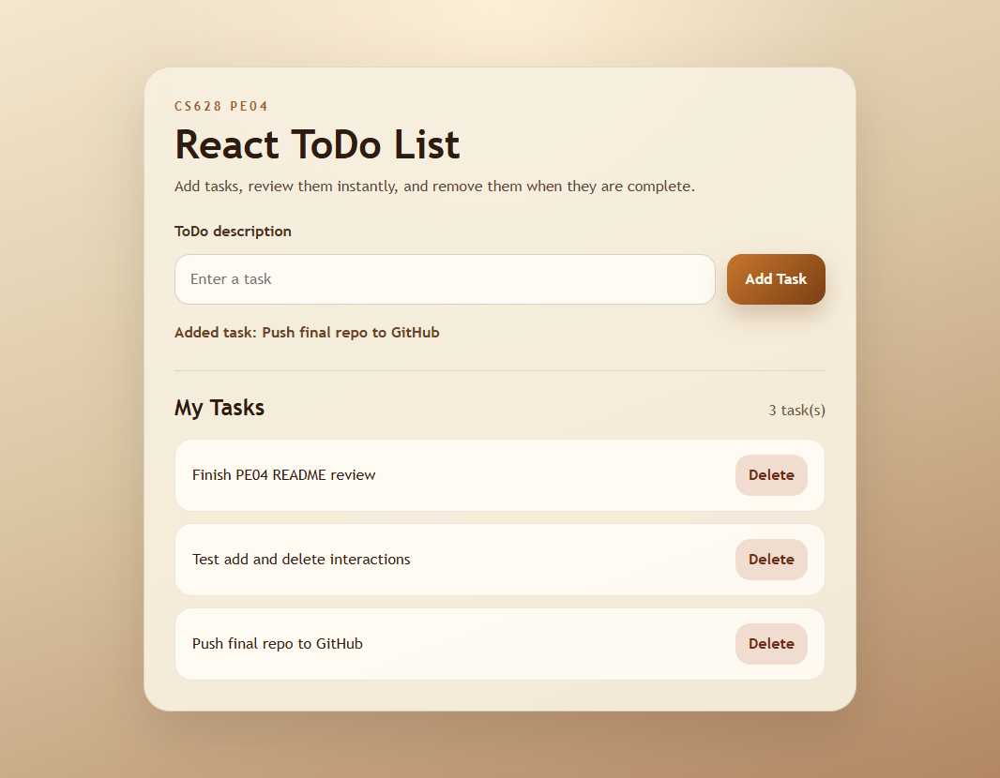
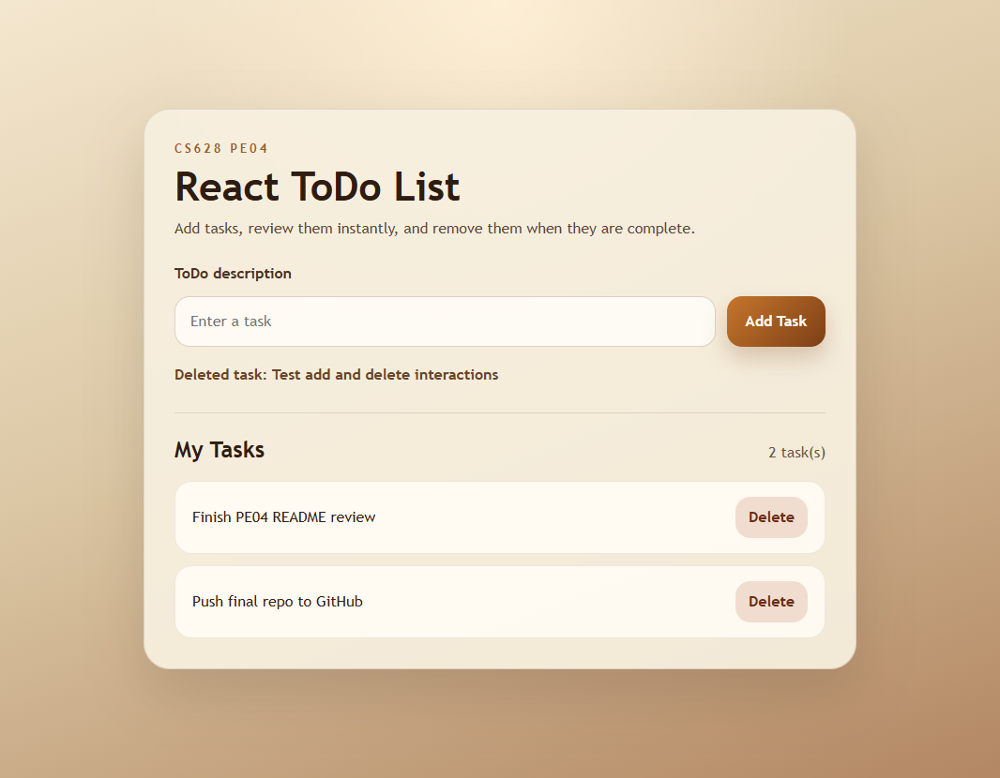

# CS628 PE04 React ToDo List

This project is a React ToDo List application built for the PE04 assignment. It uses `useState` to manage tasks, renders tasks with `.map()`, separates the list and item UI into reusable components, and includes custom responsive styling.

## Features

- Add a new task from a labeled input field.
- Prevent empty submissions with user feedback.
- Delete any task from the list.
- Show an empty-state message when no tasks exist.
- Announce status updates through an `aria-live` region.
- Verify core behavior with automated React tests.

## Project Structure

- `src/App.jsx`: owns state, add/delete handlers, and the main layout.
- `src/components/TodoList.jsx`: renders the task count, empty state, and mapped task list.
- `src/components/TodoItem.jsx`: renders a single task row and an accessible delete action.
- `src/App.test.jsx`: covers empty, add, validation, and targeted multi-item delete behaviors.

## Getting Started

### Install dependencies

```bash
npm install
```

### Start the development server

```bash
npm run dev
```

### Run the automated tests

```bash
npm test
```

### Run ESLint

```bash
npm run lint
```

### Create a production build

```bash
npm run build
```

### Run the full validation suite

```bash
npm run check
```

## Assignment Requirements Covered

- React application built with functional components.
- `useState` used for task input and task list state.
- Separate components for the ToDo list and each ToDo item.
- `.map()` used to render tasks dynamically.
- CSS styling applied for layout, spacing, and responsiveness.

## Validation

The current implementation has been validated with:

- `npm run lint`
- `npm test`
- `npm run build`
- `npm run check`

## Browser Test Preview

The app was also tested directly in the integrated browser with realistic ToDo entries.

Tested interactions:

- Empty submit feedback
- Adding multiple tasks
- Deleting an existing task

### Filled ToDo List



### After Delete Action


